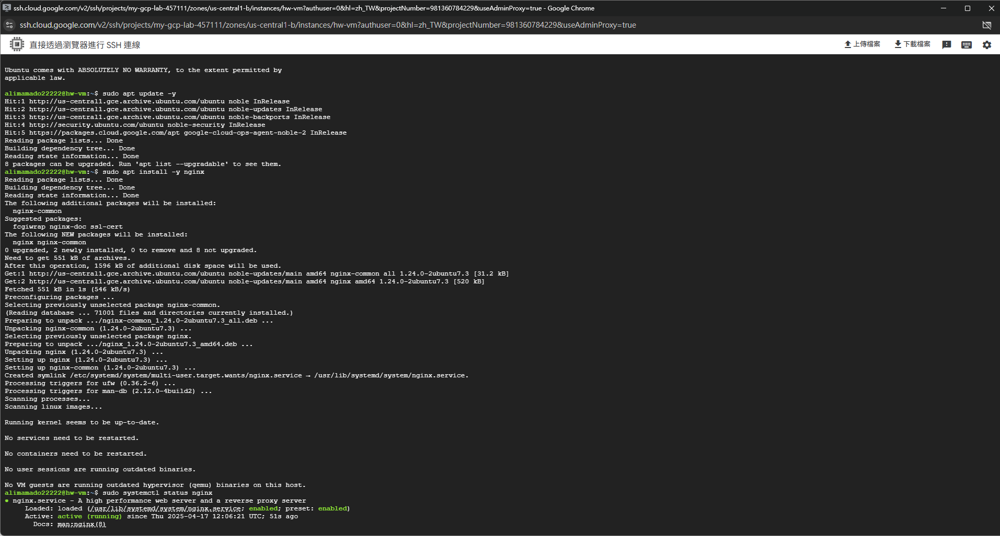

# HW3

b10705013-陳彥廷

## Step

1. 創建 `my-gcp-lab` project
2. 建立 `hw-vpc` VPC

3. 建立防火牆

4. 建立 vm

5. 安裝 nginx

6. 在瀏覽器上顯示 nginx

7. 確認 VM 運行情況

8. 停止 VM

9. 建立 GCS

10. 上傳圖片

11. 移到資料夾後再顯示圖片

12. 刪除 VM

13. 刪除 bucket

